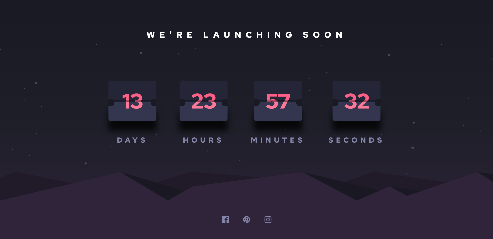

# Frontend Mentor - Launch countdown timer solution

This is a solution to the [Launch countdown timer challenge on Frontend Mentor](https://www.frontendmentor.io/challenges/launch-countdown-timer-N0XkGfyz-). Frontend Mentor challenges help you improve your coding skills by building realistic projects.

## Table of contents

- [Frontend Mentor - Launch countdown timer solution](#frontend-mentor---launch-countdown-timer-solution)
  - [Table of contents](#table-of-contents)
  - [Overview](#overview)
    - [The challenge](#the-challenge)
    - [Screenshot](#screenshot)
    - [Links](#links)
  - [My process](#my-process)
    - [Built with](#built-with)
  - [Author](#author)

## Overview

### The challenge

Users should be able to:

- See hover states for all interactive elements on the page
- See a live countdown timer that ticks down every second (start the count at 14 days)
- **Bonus**: When a number changes, make the card flip from the middle

### Screenshot

### Links

- Solution URL: [https://github.com/veeru-neerukonda/countdown-timer.git](https://github.com/veeru-neerukonda/countdown-timer.git)
- Live Site URL: [Add live site URL here](https://your-live-site-url.com)

## My process

### Built with

- Node.js And Express Server
- REST Api (AJAX)
- SASS (SCSS Syntax)
- Flexbox
- Semantic HTML
- JavaScript
- NPM

## Author

- Website - [Sriveer Neerukonda](https://veeru-portfolio.netlify.app/)
- Frontend Mentor - [@veeru-neerukonda](https://www.frontendmentor.io/profile/veeru-neerukonda)
- Twitter - [@empyrea21882174](https://twitter.com/empyrea21882174)